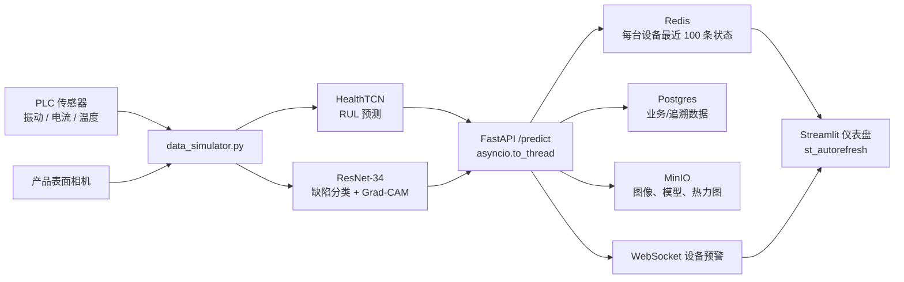

# 智能制造多模态 AI 作品集

## 在线体验

- [打开智能制造 AI 仪表盘](https://industrial-ai-dashboard-rz5t.onrender.com)
- [打开 FastAPI 接口文档（提交图片与传感器数据）](https://industrial-ai-api-zo8e.onrender.com/docs)

> Render 免费实例在无访问后会休眠。首次打开或首次提交预测时，请等待约 30–60 秒完成唤醒。

### 视觉质检样品

下图为数据合成器生成的金属产品表面样品，包含一处划痕和一处脏污；可将它上传至在线 API 或仪表盘的“视觉质检”页进行演示。


面向边缘工业场景的端到端样例：模拟 PLC 传感器与产品表面缺陷，使用 TCN 预测设备健康/RUL、ResNet-34 分类视觉缺陷，并通过 FastAPI、Redis、WebSocket 和 Streamlit 提供实时服务与仪表盘。

## 项目迭代与问题解决记录

本项目不仅提供模型与代码，也完整验证了从 GitHub 到 Render 云端的交付链路。以下记录了实现过程中遇到的典型问题、根因和最终处理方式，便于复现部署与展示工程化能力。

| 问题 | 根因 | 解决方案 |
| --- | --- | --- |
| Git 命令提示找不到文件或没有远程仓库 | 在用户主目录而不是项目目录执行命令 | 始终先 `cd` 到项目根目录，再执行 `git add`、`commit` 和 `push` |
| GitHub Actions 的 Flake8 检查失败 | 性能脚本中部分导入不在文件顶部（E402） | 调整导入顺序，并通过 Black、Flake8 与 pytest 验证 |
| Render API 启动失败，无法连接 Redis | 缓存服务尚未就绪或环境变量引用未完成 | API 启动阶段增加 Redis 重试；使用 Blueprint 注入连接串 |
| Render 无法创建新的免费缓存 | Render 免费套餐每个工作区只允许一个 Key Value 实例 | 清理旧的 Blueprint 托管缓存后，在同一区域重新创建并绑定 API |
| 云端仪表盘无法访问 API | 免费 Render Web Service 不能接收私有网络流量，仪表盘使用了内部 host:port | Dashboard 改用 API 的公开 HTTPS 地址；Redis/Postgres 仍保持内部连接 |
| `/predict` 返回 422 | 传感器字段名不匹配，或历史数据少于 5 条 | 明确使用 `vibration_mm_s`、`current_a`、`temperature_c`，并校验至少 5 条读数 |
| `/predict` 返回 502 | Streamlit 自动刷新重复创建 WebSocket；Grad-CAM 推理在免费实例上资源开销较大 | 复用每台设备的 WebSocket 订阅；冻结 ResNet 权重，仅对目标特征图求梯度，并避免重复视觉前向推理 |
| 点击 API 链接出现 `Not Found` | FastAPI 未定义根路由 `/` | 仪表盘链接直接指向 `/docs`，提供可操作的 Swagger 文档 |
| 云端预置演示图片未显示 | `.gitignore` 忽略了所有 PNG，样品图未被推送 | 为预置样品图增加例外规则，并把 PNG 作为仪表盘资源随 Docker 镜像部署 |
| 图表测试后无法恢复初始状态 | Redis 会保存每台设备最近 100 条预测 | 新增 `DELETE /devices/{device_id}/status` 与仪表盘“清空当前设备历史”按钮 |

### 本次新增的展示能力

- 云端预置视觉质检案例：无需上传图片，即可查看原图、YOLO 缺陷框、脏污分类、0.3% RUL 与设备预警。
- 在线体验入口：README、仪表盘与 API 文档均提供可点击访问链接。
- 一键清空设备历史：便于演示者在测试后让趋势图恢复初始状态。
- 面向免费云实例的推理优化：降低 Grad-CAM 推理的资源消耗，同时保留可解释性热力图。
- 可靠的实时推送：仪表盘自动刷新时复用 WebSocket 连接，避免连接泄漏。

### 演示流程

1. 打开 [云端仪表盘](https://industrial-ai-dashboard-rz5t.onrender.com)，在“视觉质检”查看预置演示案例。
2. 打开 [API 文档](https://industrial-ai-api-zo8e.onrender.com/docs)，在 `POST /predict` 上传图片并提交至少 5 条 PLC 传感器读数。
3. 返回仪表盘查看趋势、异常点和 WebSocket 预警；需要重新演示时，点击侧边栏“清空当前设备历史”。

## 架构



## 组件

| 文件 | 用途 |
| --- | --- |
| `outputs/data_simulator.py` | 生成可复现的 PLC 时序、缺陷图像和 YOLO 标签。 |
| `outputs/model_factory.py` | TCN、ResNet-34、Grad-CAM、权重保存/加载。 |
| `outputs/main.py` | FastAPI 异步推理、Redis 缓存与 WebSocket 预警。 |
| `outputs/dashboard.py` | 三页 Streamlit 实时仪表盘。 |
| `outputs/export_onnx.py` | ONNX 导出及 CPU/CUDA ONNX Runtime 推理。 |
| `outputs/benchmark_inference.py` | PyTorch 与 ONNX Runtime CPU 性能柱状图。 |

## 快速启动（Docker）

1. 复制项目后，在项目根目录执行：

   ```bash
   docker compose up --build
   ```

2. 打开服务：

   - 仪表盘：http://localhost:8501
   - API 文档：http://localhost:8000/docs
   - MinIO Console：http://localhost:9001 （账号 `minioadmin`，密码 `minioadmin123`）

3. 停止并保留数据卷：

   ```bash
   docker compose down
   ```

> 初始模型是未训练结构。生产使用前，训练模型后将 `.pt` checkpoint 挂载至 API 容器，并设置 `TCN_CHECKPOINT` 与 `VISION_CHECKPOINT`。

## 公开云端演示（Render）

仓库根目录包含 `render.yaml`，它定义了公开的 API 与 Streamlit 仪表盘，以及内部连接的 Redis 兼容缓存和 Postgres。Render 支持从该蓝图创建服务，并在 GitHub CI 检查通过后自动从 `main` 部署更新。

1. 将 GitHub 仓库可见性改为 **Public**。
2. 在 [Render Dashboard](https://dashboard.render.com/) 使用 GitHub 登录，选择 **New +** → **Blueprint**，再选择本仓库。
3. Render 读取 `render.yaml` 后，确认创建资源；完成后打开 `industrial-ai-dashboard` 分配的 `onrender.com` URL 并分享给访客。

> Render 的套餐和免费资源策略会变化。当前蓝图声明 `free` 计划；如控制台提示该资源不可用，请在创建页选择最低可用计划。API 与仪表盘默认使用随机初始化模型，部署生产版本前请在 Render 的环境变量中设置 `TCN_CHECKPOINT`、`VISION_CHECKPOINT`，并使用对象存储或持久化卷提供模型文件。

## 本地启动

```bash
python -m venv .venv
# Windows: .venv\Scripts\activate
# Linux/macOS: source .venv/bin/activate
pip install -r requirements.txt
```

依次启动 Redis、API 与仪表盘：

```bash
docker compose up redis -d
cd outputs
uvicorn main:app --reload --port 8000
streamlit run dashboard.py
```

## 调用预测 API

`/predict` 使用 `multipart/form-data`。`sensor_data` 至少包含过去 5 条传感器记录：

```bash
curl -X POST http://127.0.0.1:8000/predict \
  -F "device_id=PLC-001" \
  -F "image=@product.png" \
  -F 'sensor_data=[{"timestamp_s":0,"vibration_mm_s":1.2,"current_a":11.0,"temperature_c":42.0},{"timestamp_s":1,"vibration_mm_s":1.3,"current_a":11.1,"temperature_c":42.2},{"timestamp_s":2,"vibration_mm_s":1.4,"current_a":11.2,"temperature_c":42.4},{"timestamp_s":3,"vibration_mm_s":1.5,"current_a":11.3,"temperature_c":42.6},{"timestamp_s":4,"vibration_mm_s":1.6,"current_a":11.4,"temperature_c":42.8}]'
```

订阅预警：`ws://127.0.0.1:8000/ws/PLC-001`。当预测 RUL 小于 `RUL_ALERT_THRESHOLD`（默认 0.30）时，服务会主动推送 `设备预警`。

## 质量检查

```bash
pip install black flake8 pytest numpy pillow
black --check outputs tests
flake8 outputs tests --max-line-length=120 --extend-ignore=E203,W503
pytest -q
```

Push 或 Pull Request 会自动运行以上检查，工作流位于 `.github/workflows/ci.yml`。
