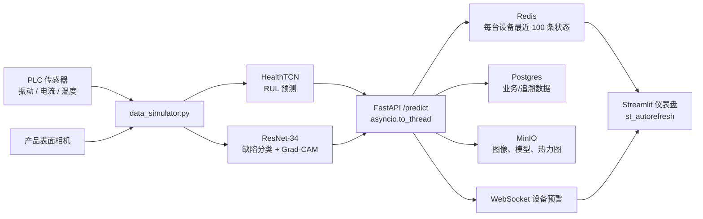

# 智能制造多模态 AI 作品集

面向边缘工业场景的端到端样例：模拟 PLC 传感器与产品表面缺陷，使用 TCN 预测设备健康/RUL、ResNet-34 分类视觉缺陷，并通过 FastAPI、Redis、WebSocket 和 Streamlit 提供实时服务与仪表盘。

## 架构



## 组件

| 文件 | 用途 |
| --- | --- |
| `outputs/data_simulator.py` | 生成可复现的 PLC 时序、缺陷图像和 YOLO 标签。 |
| `outputs/model_factory.py` | TCN、ResNet-34、Grad-CAM、权重保存/加载。 |
| `outputs/main.py` | FastAPI 异步推理、Redis 缓存与 WebSocket 预警。 |
| `outputs/dashboard.py` | 三页 Streamlit 实时仪表盘。 |
| `outputs/export_onnx.py` | ONNX 导出及 CPU/CUDA ONNX Runtime 推理。 |
| `outputs/benchmark_inference.py` | PyTorch 与 ONNX Runtime CPU 性能柱状图。 |

## 快速启动（Docker）

1. 复制项目后，在项目根目录执行：

   ```bash
   docker compose up --build
   ```

2. 打开服务：

   - 仪表盘：http://localhost:8501
   - API 文档：http://localhost:8000/docs
   - MinIO Console：http://localhost:9001 （账号 `minioadmin`，密码 `minioadmin123`）

3. 停止并保留数据卷：

   ```bash
   docker compose down
   ```

> 初始模型是未训练结构。生产使用前，训练模型后将 `.pt` checkpoint 挂载至 API 容器，并设置 `TCN_CHECKPOINT` 与 `VISION_CHECKPOINT`。

## 公开云端演示（Render）

仓库根目录包含 `render.yaml`，它定义了公开的 API 与 Streamlit 仪表盘，以及内部连接的 Redis 兼容缓存和 Postgres。Render 支持从该蓝图创建服务，并在 GitHub CI 检查通过后自动从 `main` 部署更新。

1. 将 GitHub 仓库可见性改为 **Public**。
2. 在 [Render Dashboard](https://dashboard.render.com/) 使用 GitHub 登录，选择 **New +** → **Blueprint**，再选择本仓库。
3. Render 读取 `render.yaml` 后，确认创建资源；完成后打开 `industrial-ai-dashboard` 分配的 `onrender.com` URL 并分享给访客。

> Render 的套餐和免费资源策略会变化。当前蓝图声明 `free` 计划；如控制台提示该资源不可用，请在创建页选择最低可用计划。API 与仪表盘默认使用随机初始化模型，部署生产版本前请在 Render 的环境变量中设置 `TCN_CHECKPOINT`、`VISION_CHECKPOINT`，并使用对象存储或持久化卷提供模型文件。

## 本地启动

```bash
python -m venv .venv
# Windows: .venv\Scripts\activate
# Linux/macOS: source .venv/bin/activate
pip install -r requirements.txt
```

依次启动 Redis、API 与仪表盘：

```bash
docker compose up redis -d
cd outputs
uvicorn main:app --reload --port 8000
streamlit run dashboard.py
```

## 调用预测 API

`/predict` 使用 `multipart/form-data`。`sensor_data` 至少包含过去 5 条传感器记录：

```bash
curl -X POST http://127.0.0.1:8000/predict \
  -F "device_id=PLC-001" \
  -F "image=@product.png" \
  -F 'sensor_data=[{"timestamp_s":0,"vibration_mm_s":1.2,"current_a":11.0,"temperature_c":42.0},{"timestamp_s":1,"vibration_mm_s":1.3,"current_a":11.1,"temperature_c":42.2},{"timestamp_s":2,"vibration_mm_s":1.4,"current_a":11.2,"temperature_c":42.4},{"timestamp_s":3,"vibration_mm_s":1.5,"current_a":11.3,"temperature_c":42.6},{"timestamp_s":4,"vibration_mm_s":1.6,"current_a":11.4,"temperature_c":42.8}]'
```

订阅预警：`ws://127.0.0.1:8000/ws/PLC-001`。当预测 RUL 小于 `RUL_ALERT_THRESHOLD`（默认 0.30）时，服务会主动推送 `设备预警`。

## 质量检查

```bash
pip install black flake8 pytest numpy pillow
black --check outputs tests
flake8 outputs tests --max-line-length=120 --extend-ignore=E203,W503
pytest -q
```

Push 或 Pull Request 会自动运行以上检查，工作流位于 `.github/workflows/ci.yml`。
